# ImageViewer


A modern, feature-rich image viewer application built with C# and WPF, following clean architecture principles.

## 🖼️ Overview

This ImageViewer is a WPF-based application designed to provide a smooth and intuitive image viewing experience. The application follows a layered architecture pattern with proper separation of concerns, making it maintainable and extensible.

## ✨ Features

- **🎨 Modern UI**: Built with WPF and DevExpress components for a professional look
- **🌓 Theme Support**: Light and Dark themes with custom icons and resources
- **📁 Directory Navigation**: Browse images in specified directories
- **🎯 MVVM Architecture**: Clean separation using CommunityToolkit.Mvvm
- **⚡ Dependency Injection**: Microsoft.Extensions.DependencyInjection for loose coupling
- **📖 Command-line Support**: Launch with custom directory paths
- **🔄 Resource Management**: Optimized image loading and display

## 🏗️ Architecture

The application follows a clean architecture pattern with multiple layers:

```
📦 ImageViewer Solution
├── 🚀 ImageViewer.Launcher              # Entry point and application launcher
├── 🏠 UI.ImageViewer.Host               # Main WPF application host
├── 🎨 UI.ImageViewer                    # UI layer with MVVM components
├── 📋 Application.ImageViewer           # Application logic layer
└── 🔧 Infrastructure.Presentation.ImageViewer  # Infrastructure layer
```

### 🔗 Reference Dependencies

The following Mermaid diagram shows the project reference relationships:

```mermaid
graph TD
    A["🚀 ImageViewer.Launcher<br/>(Entry Point)"] --> B["🏠 UI.ImageViewer.Host<br/>(Main WPF App)"]
    
    B --> C["🎨 UI.ImageViewer<br/>(UI Layer)"]
    B --> D["📋 Application.ImageViewer<br/>(Business Logic)"]
    
    C --> E["🔧 Infrastructure.Presentation.ImageViewer<br/>(Infrastructure Layer)"]
    C --> D
    
    E --> D
    
    style A fill:#e1f5fe
    style B fill:#f3e5f5
    style C fill:#e8f5e8
    style D fill:#fff3e0
    style E fill:#fce4ec
    
    classDef entryPoint fill:#e1f5fe,stroke:#01579b,stroke-width:2px
    classDef host fill:#f3e5f5,stroke:#4a148c,stroke-width:2px
    classDef ui fill:#e8f5e8,stroke:#1b5e20,stroke-width:2px
    classDef application fill:#fff3e0,stroke:#e65100,stroke-width:2px
    classDef infrastructure fill:#fce4ec,stroke:#880e4f,stroke-width:2px
    
    class A entryPoint
    class B host
    class C ui
    class D application
    class E infrastructure
```



### 📊 Reference Flow Analysis

1. **🚀 ImageViewer.Launcher** (Entry Point)
   - References `UI.ImageViewer.Host` to bootstrap the main application

2. **🏠 UI.ImageViewer.Host** (Main WPF Application)
   - References `UI.ImageViewer` for UI components
   - References `Application.ImageViewer` for business logic

3. **🎨 UI.ImageViewer** (UI Layer)
   - References `Infrastructure.Presentation.ImageViewer` for presentation infrastructure
   - References `Application.ImageViewer` for business logic

4. **🔧 Infrastructure.Presentation.ImageViewer** (Infrastructure Layer)
   - References `Application.ImageViewer` for business logic

5. **📋 Application.ImageViewer** (Business Logic)
   - No external project references (core layer)

### Layer Responsibilities

- **Launcher**: Handles command-line arguments and bootstraps the application
- **Host**: Main WPF application, resource management, and theming
- **UI**: User interface components, view models, and MVVM implementation
- **Application**: Business logic and application services
- **Infrastructure**: External dependencies and presentation infrastructure

### 🏗️ Architecture Benefits

- **Clean Architecture**: Dependencies flow inward toward the core business logic
- **Dependency Inversion**: `Application.ImageViewer` serves as the core with other layers depending on it
- **Layer Separation**: Each layer has clear responsibilities and boundaries
- **Unidirectional Dependencies**: No circular references, maintaining clean structure
- **Testability**: Business logic is isolated and easily testable
- **Maintainability**: Changes in outer layers don't affect inner layers

## 🛠️ Technical Stack

- **Framework**: .NET 7.0 Windows
- **UI**: WPF (Windows Presentation Foundation)
- **Architecture**: Clean Architecture with MVVM pattern
- **Dependencies**:
  - CommunityToolkit.Mvvm (8.2.1)
  - DevExpress.Mvvm.CodeGenerators (22.1.1)
  - DevExpress.Wpf.Core (23.2.*)
  - Microsoft.Extensions.DependencyInjection (8.0.0)

## 📋 Prerequisites

- .NET 7.0 SDK or later
- Windows 10/11
- Visual Studio 2022 (recommended) or Visual Studio Code

## 🚀 Installation

1. **Clone the repository**:
   ```bash
   git clone <repository-url>
   cd C_Charp_ImageViewer
   ```

2. **Restore NuGet packages**:
   ```bash
   dotnet restore
   ```

3. **Build the solution**:
   ```bash
   dotnet build
   ```

4. **Run the application**:
   ```bash
   dotnet run --project ImageViewer.Launcher
   ```

## 📖 Usage

### Basic Usage

1. **Launch the application**:
   - Double-click the executable
   - Or run from command line: `ImageViewer.Launcher.exe`

2. **With custom directory**:
   ```bash
   ImageViewer.Launcher.exe "C:\Your\Image\Directory"
   ```

3. **Default directory**: If no path is provided, the application uses:
   ```
   C:\Users\juhyu\Pictures\Screenshots
   ```

### Features

- **Navigation**: Use navigation controls to browse through images
- **Themes**: Switch between Light and Dark themes
- **Zoom**: Zoom in/out functionality for detailed viewing
- **File Support**: Common image formats (PNG, JPG, JPEG, GIF, BMP, etc.)

## 🎨 Theming

The application supports both Light and Dark themes with:
- Custom icons for each theme
- Themed resource dictionaries
- Consistent color schemes
- Optimized readability

## 🔧 Development

### Project Structure

```
├── ImageViewer.Launcher/
│   ├── Program.cs                 # Application entry point
│   └── ImageViewer.Launcher.csproj
├── UI.ImageViewer.Host/
│   ├── Abstractions/
│   │   └── Resources/
│   │       └── Themes/
│   │           ├── Dark/          # Dark theme resources
│   │           └── Light/         # Light theme resources
│   └── UI.ImageViewer.Host.csproj
├── UI.ImageViewer/
│   └── UI.ImageViewer.csproj      # MVVM UI components
├── Application.ImageViewer/
│   └── Application.ImageViewer.csproj  # Business logic
└── Infrastructure.Presentation.ImageViewer/
    └── Infrastructure.Presentation.ImageViewer.csproj
```

### Building from Source

1. **Debug build**:
   ```bash
   dotnet build --configuration Debug
   ```

2. **Release build**:
   ```bash
   dotnet build --configuration Release
   ```

3. **Run tests** (if available):
   ```bash
   dotnet test
   ```

## 📝 Configuration

The application uses:
- **Resource dictionaries** for theming
- **Dependency injection** for service management
- **MVVM pattern** for UI logic separation

## 🤝 Contributing

1. Fork the repository
2. Create a feature branch (`git checkout -b feature/amazing-feature`)
3. Commit your changes (`git commit -m 'Add amazing feature'`)
4. Push to the branch (`git push origin feature/amazing-feature`)
5. Open a Pull Request

## 📄 License

This project is licensed under the MIT License - see the LICENSE file for details.

## 🙏 Acknowledgments

- Built with [DevExpress WPF Components](https://www.devexpress.com/products/net/controls/wpf/)
- Uses [CommunityToolkit.Mvvm](https://github.com/CommunityToolkit/dotnet) for MVVM implementation
- Powered by [.NET 7.0](https://dotnet.microsoft.com/download/dotnet/7.0)
